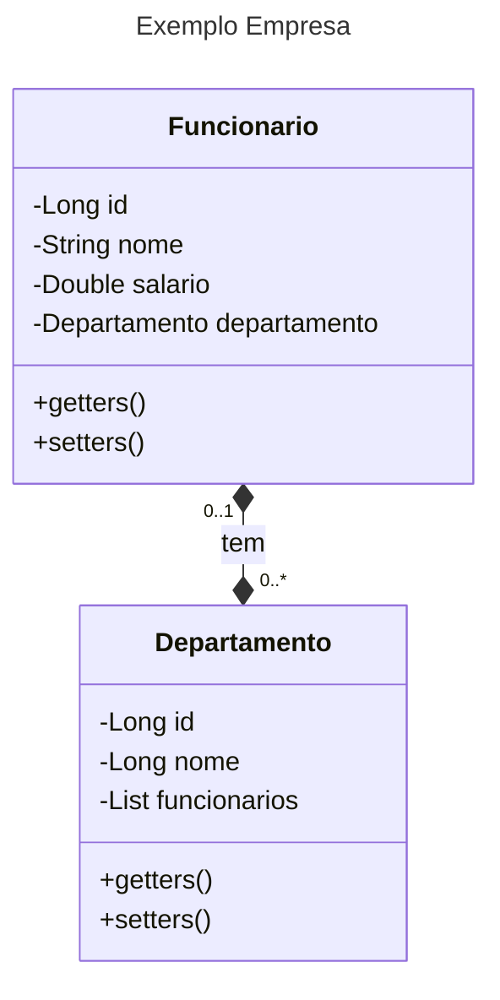

# Hibernate
## Introdução ao Hibernate e JPA

O Hibernate é um framework de persistência de objetos para Java. Ele fornece uma maneira muito direta de mapear objetos Java para tabelas de banco de dados, e vice-versa.
Com o Hibernate, você pode trabalhar com dados de banco de dados em um nível mais abstrato do que comparado ao JDBC, utilizando objetos Java. Ele se encarrega de lidar com a comunicação com o banco de dados, fazendo o mapeamento entre os objetos e a estrutura e tabelas do banco de dados.

## O que é o Hibernate?
O Hibernate é um framework de mapeamento *objeto/relacional* (ORM)* para Java. Ele facilita a interação entre objetos Java e bancos de dados relacionais, automatizando tarefas complexas como mapeamento de objetos para tabelas, gerenciamento de transações e consultas.
O Hibernate oferece uma camada de abstração sobre o JDBC, permitindo que os desenvolvedores trabalhem com objetos Java ao invés de SQL puro. Isso simplifica o desenvolvimento, aumenta a produtividade e torna o código mais fácil de manter.

* *ORM* (Object/Relational Mapping) ou em português Mapeamento Objeto/Relacional.

### Arquitetura
  O Hibernate é um framework que fica entra a camada de acesso de dados e o banco relacional. Os dados são manipulados no banco de dados através das APIs do Hibernate.

  

  Através de um  provedor *Jakarta Pesistence*, o framework implementas as especificações da API Java Persistence e suas associações, conforme o diagrama a seguir:
  

### SessionFactory (org.hibernate.SessionFactory)
Uma representação thread-safe (e imutável) do mapeamento do modelo de domínio do aplicativo para um banco de dados. Atua como uma fábrica de instâncias da *org.hibernate.Session* . O *EntityManagerFactory* é o equivalente a uma SessionFactory do Jakarta Persistence e basicamente, e suaus implementações são similares SessionFactory.

A criação da fábrica SessionFactory utiliza muitos recursos computacionais, portanto, para qualquer banco de dados, o aplicativo deve ter apenas um arquivo SessionFactory. A fábrica SessionFactory mantém os serviços que o Hibernate usa em todos Session(s), como caches de segundo nível, pools de conexões, integrações de sistemas de transações, etc.

### Sessão (org.hibernate.Session)
Um objeto de thread único e de curta duração que modela conceitualmente uma "Unidade de Trabalho" ( PoEAA ). Na nomenclatura Jakarta Persistence, o Session é representado por um EntityManager.

Uma Session, por baixo dos panos envolve um JDBC java.sql.Connection e atua como uma fábrica de instâncias da org.hibernate.Transaction . Ela mantém um contexto de persistência geralmente de "leitura repetível" (cache de primeiro nível) do modelo de domínio do aplicativo.

### Transação ( org.hibernate.Transaction)
Um objeto de thread único e de curta duração usado pelo aplicativo para demarcar limites de transações físicas individuais. A EntityTransaction é o equivalente do Jakarta Persistence e ambos atuam como uma API de abstração para isolar o aplicativo do sistema de transação subjacente em uso (JDBC ou JTA).


Mas o que faz que é ORM?


Por que utilizar Hibernate?

- O Hibernate simplifica o acesso a dados, reduzindo o código *boiler plate* podendo assim o desenvolvedoR se focar na regra de negócios. Isso permite que você construa aplicações com mais rapidez e eficiência.
- O Hibernate oferece recursos avançados como transações, gerenciamento de cache e otimização de consultas, que contribuem para a criação de aplicações mais robustas e performáticas, se comparadas ao JDBC.
- O Hibernate é superior ao JDBC, seja pela redução no tempo de desenvolvimento, bem como em perfomance nas operações de persistência de dadaos.

Operações CRUD com Hibernate

O Hibernate simplifica a realização de operações CRUD (Create, Read, Update, Delete) em bases de dados. Com o framework, você pode executar essas operações em objetos Java, sem a necessidade de escrever código SQL.
Para criar um novo registro, use o método *save()*. Para ler um registro, use o método *get()*. Para atualizar um registro, use o método *update()*. E para deletar um registro, use o método *delete()*.
Fontes:

## Mapeamento de objetos para tabelas

Com o Hibernate a interação entre objetos Java e tabelas de banco de dados fica mais transparente. Ele abstrai a complexidade do mapeamento manual de objetos, permitindo que você trabalhe com seus objetos Java como se o banco de dados também fosse orientado a objetos.

1 - Definição de entidades
Você define suas entidades Java, representando as tabelas do seu banco de dados. Cada classe Java corresponde a uma tabela, e seus atributos correspondem às colunas.

2 - Mapeamento de atributos
O Hibernate utiliza anotações ou arquivos XML para mapear os atributos de suas entidades com as colunas correspondentes nas tabelas do banco de dados.

3 - Gerenciamento de relacionamentos
Ele suporta diferentes tipos de relacionamentos entre entidades, como um-para-um, um-para-muitos e muitos-para-muitos, permitindo que você modele relacionamentos complexos entre suas tabelas.
Essa capacidade de mapeamento facilita o desenvolvimento e a manutenção de aplicações, pois você pode se concentrar na regra do negócio sem se preocupar com os detalhes do mapeamento entre objetos e tabelas. Com o Hibernate, você terá um código mais legível, mais fácil de manter e com menos chances de erros.

## Hibernate Query Language (HQL)

HQL é uma linguagem de consulta orientada a objetos, que permite aos desenvolvedores consultar e manipular dados persistidos no banco de dados de forma mais intuitiva e independente da estrutura do banco de dados. É uma linguagem poderosa e flexível, semelhante ao SQL, mas com sintaxes e funcionalidades específicas para a manipulação de objetos. 
A grande vantagem em se utilizar HQL, é que por exemplo, em caso de troca da base dados em utilização, não há necessidade de reescrita das consultas SQL, pois isso é feito pelo próprio Framework, ao se configurar o novo dialeto.
https://thorben-janssen.com/jpql/
https://www.tutorialspoint.com/jpa/jpa_jpql.htm

## Transações e gerenciamento de sessão

O Hibernate fornece mecanismos para gerenciar transações e sessões, garantindo a integridade e a consistência dos dados. Transações encapsulam um conjunto de operações que devem ser executadas como uma unidade atômica, ou seja, todas as operações devem ser concluídas com sucesso ou nenhuma delas é efetivada. O gerenciamento de sessões é crucial para controlar o ciclo de vida dos objetos e a interação com o banco de dados.

O Hibernate oferece diferentes abordagens para lidar com transações, como gerenciamento de transações por meio da API JTA (Java Transaction API) ou usando transações programadas. O gerenciamento de sessões é normalmente feito por meio de um padrão de fábrica, permitindo a criação e o fechamento de sessões conforme necessário.

[Getting Started with Hibernate](https://docs.jboss.org/hibernate/orm/6.3/quickstart/html_single/])

MappedBy - Informa quem é o pai de um relacionamento Bi-direcional
[Como utilizar MappedBy](https://developer.jboss.org/docs/DOC-55914)

Para uma aplicação básica utilizando o Hibernate precisaremos configurar nosso projeto da seguinte forma:

Para o exemplo a seguir, utilizaremos Lombok, para simplificar os acessos a nossas classe.

O Hibernate Core, que é o framework do Hibernate em si.

A Jakarta Pesistence API (JPA).

O Driver do Postgres.

E o SLF4J, para logar as operações realizadas em nosso banco de dados.

Arquivo pom.xml
```xml
    <dependencies>
        <dependency>
            <groupId>org.projectlombok</groupId>
            <artifactId>lombok</artifactId>
            <version>1.18.32</version>
            <scope>provided</scope>
        </dependency>
        <!-- https://mvnrepository.com/artifact/org.hibernate.orm/hibernate-core -->
        <dependency>
            <groupId>org.hibernate.orm</groupId>
            <artifactId>hibernate-core</artifactId>
            <version>6.5.2.Final</version>
        </dependency>

        <!-- https://mvnrepository.com/artifact/org.postgresql/postgresql -->
        <dependency>
            <groupId>org.postgresql</groupId>
            <artifactId>postgresql</artifactId>
            <version>42.7.3</version>
        </dependency>

        <!-- https://mvnrepository.com/artifact/jakarta.persistence/jakarta.persistence-api -->
        <dependency>
            <groupId>jakarta.persistence</groupId>
            <artifactId>jakarta.persistence-api</artifactId>
            <version>3.2.0</version>
        </dependency>
        <!-- https://mvnrepository.com/artifact/org.slf4j/slf4j-api -->
        <dependency>
            <groupId>org.slf4j</groupId>
            <artifactId>slf4j-api</artifactId>
            <version>2.0.13</version>
        </dependency>
        <!-- https://mvnrepository.com/artifact/org.slf4j/slf4j-simple -->
        <dependency>
            <groupId>org.slf4j</groupId>
            <artifactId>slf4j-simple</artifactId>
            <version>2.0.13</version>
            <scope>test</scope>
        </dependency>
    </dependencies>
```

Com as dependencias configuradas, será necessário criar um arquivo de configuração do Hibernate.
Esse arquivo, deverá ser criado e configurado nas resources, de nosso projeto.
resources->hibernate.cfg.xml

```xml
<?xml version="1.0" encoding="UTF-8"?>
<!DOCTYPE hibernate-configuration PUBLIC "-//Hibernate/Hibernate Configuration DTD 3.0//EN" "http://www.hibernate.org/dtd/hibernate-configuration">
<hibernate-configuration>
    <session-factory>
        <!-- Configurações do PostgreSQL -->
        <property name="hibernate.connection.url">jdbc:postgresql://localhost:5432/postgres</property>
        <property name="hibernate.connection.username">postgres</property>
        <property name="hibernate.connection.password">1234</property>

        <!-- Configurações do Hibernate -->
        <property name="hibernate.hbm2ddl.auto">update</property>
        <property name="hibernate.show_sql">true</property>

        <!-- Mapeamento de Classe -->
        <mapping class="hibernate.Model.Departamento"/>
        <mapping class="hibernate.Model.Funcionario"/>
    </session-factory>
</hibernate-configuration>
```

Nesse arquivo, são configuradas as seguintes informações:
Dados referentes a conexão com o bando de dados a ser utilizado.
Qual será o comportamento do Hibernate, em específico na propriedade:

 <property name="hibernate.hbm2ddl.auto">update</property>
 
Essa propriedade indica o que deve ser feito, caso haja alteração no esquema de uma de nossa tabelas.

Com o update, caso as tabelas ainda não existam no banco de dados, elas serão criadas, na primeira vez que nosso programa for executado. 
As modificações subsequentes serão feitas, com "update", sobre as tabelas já existentes.

Na configuração do Hibernate, ainda é necessário indicar quais são as entidades, as quais serâo persistidas no banco de dados.

Implementaremos um modelo extremamente simples, somente para compreender como o Hibernate funciona, como se dão as antoações para que a JPA, compreenda o que estamos modelando, e como funciona o lombok.



Classe departamento:
``` java
@Entity
@Data
@AllArgsConstructor
@NoArgsConstructor
@Builder
public class Departamento {
    @Id
    @Column(name="id",nullable=false)
    @GeneratedValue(strategy = GenerationType.IDENTITY)
    private Long id;
    @Column(unique=true, name="nome", nullable=false)
    private String nome;
    @OneToMany(mappedBy = "departamento", fetch = FetchType.EAGER)
    private List<Funcionario> funcionarios;

    @Override
    public String toString() {
        return "Departamento{" +
                "id=" + id +
                ", nome='" + nome + '\'' +
                '}';
    }
}
```

Classe Funcionário
```java
@Entity
@Data
@NoArgsConstructor
@AllArgsConstructor
@Builder
public class Funcionario {

    @Id
    @Column(name="id")
    @GeneratedValue(strategy = GenerationType.IDENTITY)
    private Long id;
    @Column(unique=true, nullable=false,length=50,name="nome")
    private String nome;
    @Column(name = "salario")
    private Double salario;
    @ManyToOne(fetch = FetchType.EAGER)
    private Departamento  departamento;

    @Override
    public String toString() {
        return nome + " " + salario+ " " + departamento.getNome();
    }
}
```


Criando um Departamento:

```java
        //Aponta para o local onde se encontram as configurações feitas no hibernate.cfg.xml
        Configuration cfg = new Configuration().configure("/hibernate.cfg.xml");
        //Cria uma factory
        SessionFactory factory = cfg.buildSessionFactory();

        //Cria uma nova session
        Session session = factory.openSession();

        //Inicia uma nova transaction
        session.beginTransaction();

        //Cria um novo objeto departamento
        Departamento departamento = new Departamento();
        departamento.setNome("Expedição");

        //Salva o novo departamento no repositório
        session.persist(departamento);

        //Confirma a transação. Caso alguma das ações dadas após beginTransacation(), de errado, todas as outras ações feitas são canceladas.
        session.getTransaction().commit();
        session.close();
        factory.close();
```

Criando um Funcionário:

```java
        //Aponta para o local onde se encontram as configurações feitas no hibernate.cfg.xml
        Configuration cfg = new Configuration().configure("/hibernate.cfg.xml");
        //Cria uma factory
        SessionFactory factory = cfg.buildSessionFactory();

        //Cria uma nova session
        Session session = factory.openSession();

        //Inicia uma nova transaction
        session.beginTransaction();

        //Cria um novo objeto funcionário
        Funcionario funcionario = new Funcionario();
        funcionario.setNome("Lucas");
        funcionario.setSalario(1000.0);

        //Devemos buscar o departamento da nossa base de dados para aí então atribui-lo a nosso funcionário.
         Departamento departamento = session.createQuery("SELECT d from Departamento d WHERE d.nome=:nome", Departamento.class).setParameter("nome", "Expedição").getSingleResult();

        funcionario.setDepartamento(departamento);

        //Salva o novo departamento no repositório
        session.persist(funcionario);

        //Confirma a transação. Caso alguma das ações dadas após beginTransacation(), de errado, todas as outras ações feitas são canceladas.
        session.getTransaction().commit();
        session.close();
        factory.close();
```
